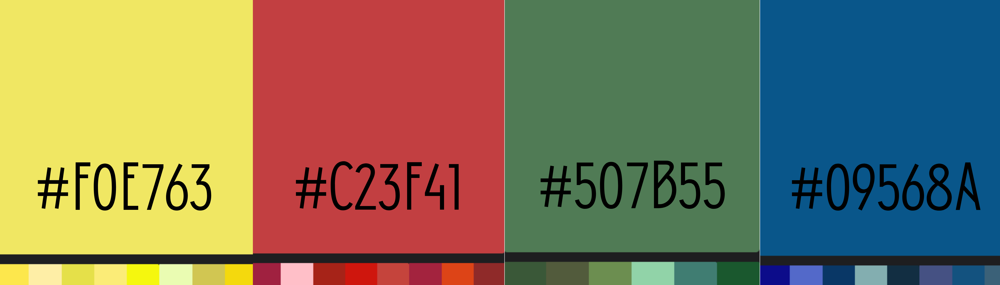
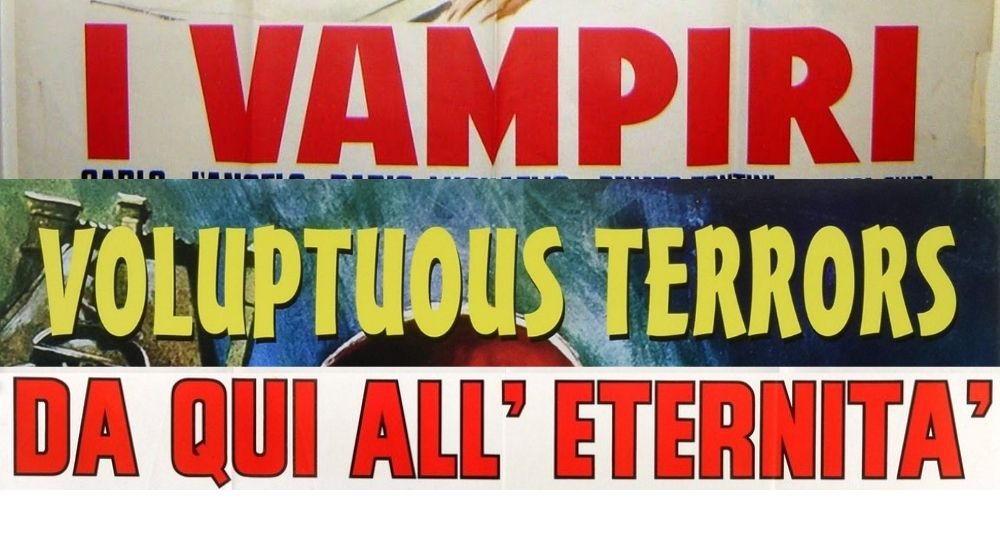
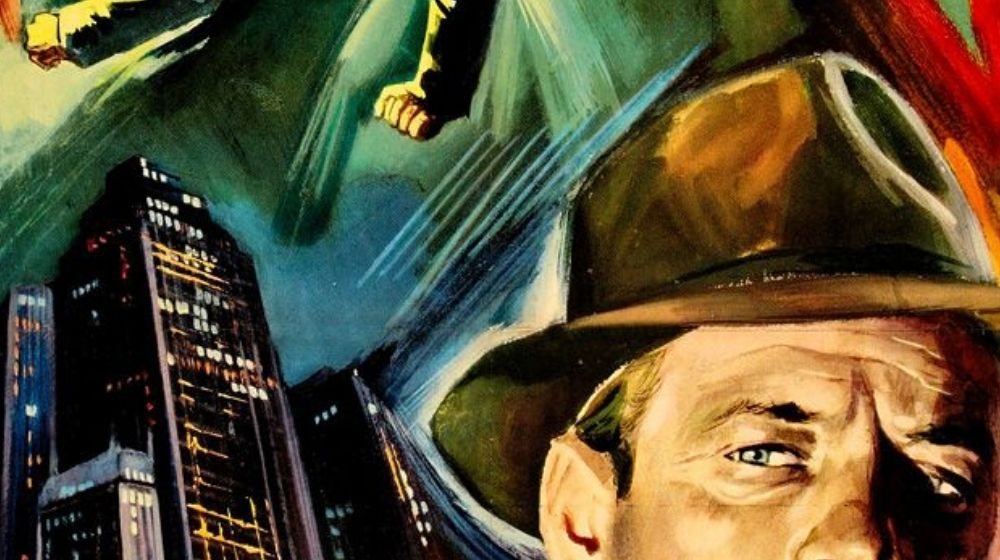

I thought my first blog post should be taking you through my creative process of choosing my logo, as well as the decisions involved in making the colour palette and patterns you will see while navigating the site.

Italian film posters have such a distinctive feel about them, and for my site branding I am looking to mimic the stylistic techniques used in their manufacture and translate these to simple designs on Adobe InDesign and Canva.

I started browsing through some books on the subject, and trust me when I say that finding 3 books on such a niche topic was as much as a surprise to me as it is to you.

3 different design elements occurred frequently in the posters I looked at. Let’s look at what these were and what makes them so popular.

#### **Primary and Secondary Colours**

The most striking element linking all of these posters with one another was definitely the bold colour palette. Primary and secondary colours were often used in this ‘Golden Age’ of Italian cinema in stark contrast to the greys and browns symbolic of Italy’s militaristic wartime environment of the 1930s-40s.

The positive connotations of the colours used in these posters would promise a lift in spirits to a potential customer, a welcome offer in a time of distress.

I used an eyedropper tool extension on Chrome to identify the colours used most often in Italian film posters and mixed each colour category together to create a palette for use sitewide. 

#### Bold Lettering

These film posters were typically produced either by lithographic press or off-set printing, two techniques allowing mass production for the widespread screenings across Italy.

Both of these techniques required fairly simplified designs in order to be legible, especially the text. This meant that most posters would contain bold lettering, usually in a brighter yellow colour, in order to stand out against the background.

#### Impressionist Style

It goes without saying that these posters were created in a time before photoshop and InDesign. Even colour photography wasn’t in widespread use yet. This meant artists were commissioned to paint pieces that subtly expressed plot, feel and genre in a way that would entice the audience to find out more. Clumsy, impressionist brush strokes brought these paintings to life, allowing the bold, stagnant lettering to stand out even more.

While these classic design elements suit Italian film posters perfectly, I wanted to adapt these to better suit my personal style and the modern format of a blog.

I was intrigued by the incorporation of classic and modern techniques used to create these posters and designed a logo that I thought combined modern and classic, as well as the other design elements I already discussed.\
\
This led to the creation of my logo:

 

And the motif of block colours and line drawings I will be using site wide.

Happy reading