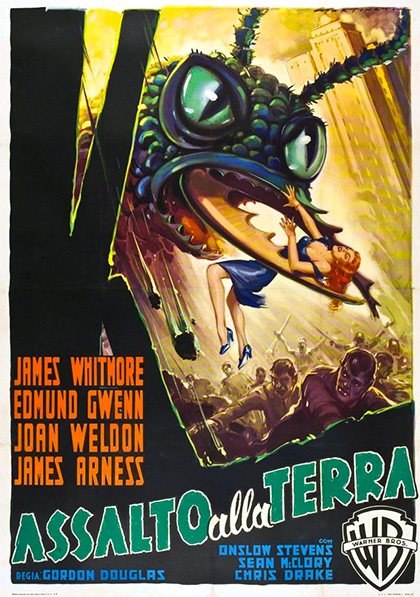
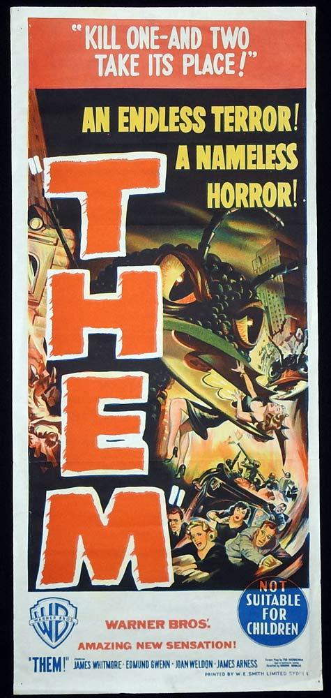
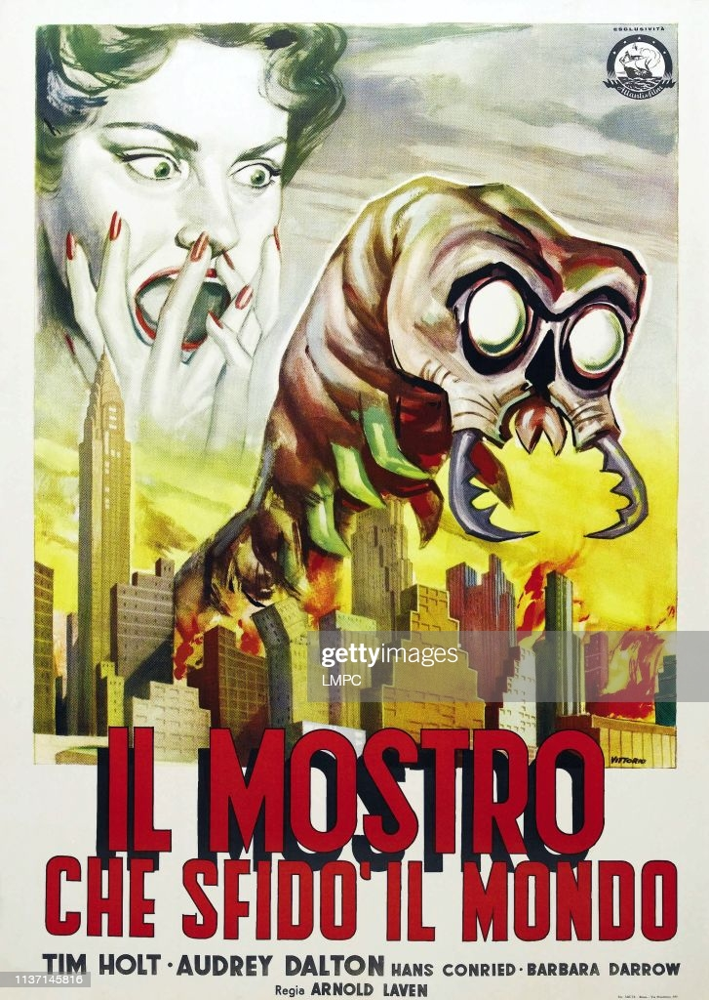
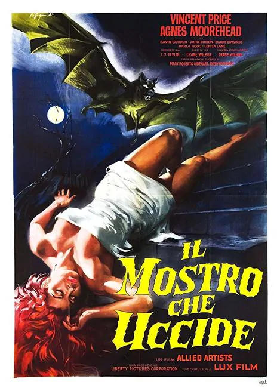

Italian film posters were often burned by the cinemas after the show running ended, making the originals incredibly rare and quite the find for collectors. We know by now how important these posters were to the paratext of the film itself, and at first, I wanted to do a ranking of my favourites, but I fear the films I’ve already seen and those that have sentimental meaning to me would make me bias.\
I’ve decided to take things in a different direction.\
I have decided to rank Italian films I have never seen, based purely on how absolutely insane the posters look. Let’s go.

**\#6: ASSALTO ALLA TERRA (“Attack On Earth”)**

\
*Distributor: Warner Brothers (1954)*\
*Artist: Luigi Martinati*

The composition of this poster is honestly nothing special. We have a looming threat in the top third of the poster, terrified crowds in the bottom third, and quite the eyeful of our leading lady in the middle.

What struck me about this one, other than the gigantic fly defying all laws of physics with its questionable grip on our damsel in distress, is the harmony (if we can call it that) between the painting and the typography itself. Contrary to the complimentary orange of the billing on the left, the title flows in the same direction our eyes travel when inspecting this poster. It’s green, like the fly, and a little rough around the edges, which is a refreshing find in Italian film posters but not particularly for the work of Luigi Martinati, the painter and studio favourite for manufacturing these posters.\
I actually wanted to compare this particular poster to its American counterpart, which, would you believe, is actually ten times louder. Many film posters manufactured by Hollywood were usually quite jarring to look at, tailored to the American market.

\
This makes Martinati’s choices all the more compelling. Joan Weldon’s dress is even changed from a suggestive red to a tranquil blue, almost downplaying the blatant chaos of the scene in question. I would be curious to watch this one, if for no other reason than to see which poster feels more apt to the plot.

**\#5: IL MOSTRO CHE SFIDO IL MONDO (“The Monster That Challenged The World”)**

\
*Distributor: Atlantis Film (1957)*\
*Artist: Giuliano Vittorio*

What. The hell. Is that. If the weird spiny larvae of the spawn of Satan wasn’t intriguing enough in this poster, its towering stance over burning buildings and the disembodied head of a screaming woman should cement this film in your watch list. I’m well aware when analysing these posters that the actual film may be completely different to what the poster conveys, but in this case I really bloody hope its not. The whole feel of what I’m looking at gives me the creepy crawlies. The volume of the expressionist poster is matched by the Hollywood style emboldened text escaping its designated text box in the same way we see this angry centipede escaping the blazing inferno of the city that once was. The light colours used by Vittorio allow for a black shadow behind the first line of the title, which combines two methods of 3D-ifying (I might have made that word up,) a 2D image both in the painting and the typography.\
I would be lying if I said the typography was the main reason I was intrigued by this film though, I just want to know what the hell is going on here.

**\#4: IL MOSTRO CHE UCCIDE (“The Murdering Monster”)**

\
*Distributor: Lux Film*\
*Artist: Alessandro Biffignandi*

So, this one is fairly unassuming. I’ve seen enough horror films to know that an unconscious woman and a bat means ‘Vampire.’ What intrigues me about this poster, however, is the echoed motif of the scalloped bat wings in the typography at the bottom. This poster has the classic yellow text and black border, a contrast of choice in these old Italian film posters, but the unique, sharp edges of the letters and the cloud like drifting of the suspended words give the whole poster an anxiety-inducing spooky air (if the gigantic evil bat didn’t provide that already.)\
You can feel the suspense in the composition alone, and the symmetry of the yellow bat wings and the text, as well as the red billing and the flowing hair, make this poster so aesthetically satisfying in contrast to the obvious horror theme. The beautiful simplicity of this poster alone makes me want to watch it, in hopes suspense is built just as artfully by Director Crane Wilbur as artist Alessandro Biffignandi managed in the poster.

Click Here To See My Top 3