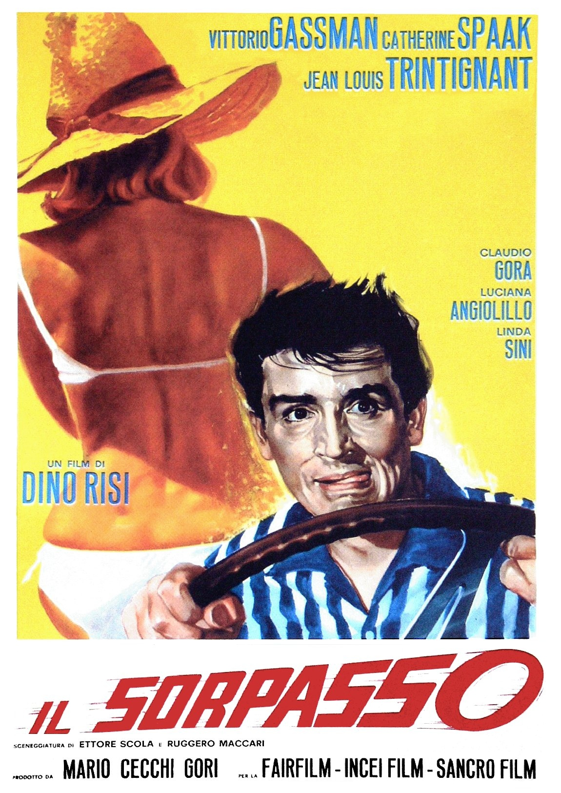
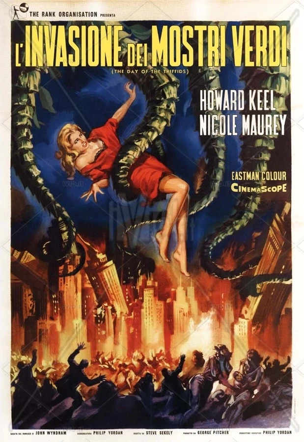
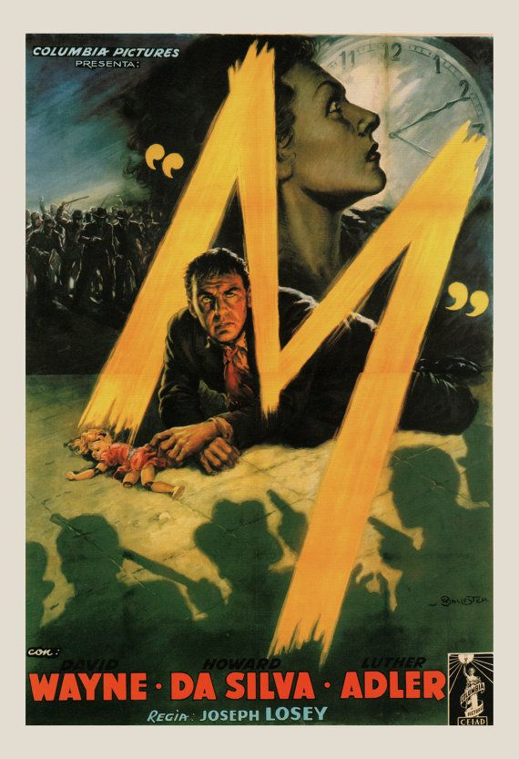

*This blog post is a continuation of my last, and a ranking of my favourite unseen Italian Films based on their poster alone. You can find it [here](https://cinemaparadiso.netlify.app/2020/12/09/definitive-ranking/).*\
\
**\#3: IL SORPSASSO (“The Easy Life/Speeding”)**

\
*Distributor:*\
*Artist: Mauro Innocenti*

This poster is an example of one where the poster and the title are kept completely separate.\
It is one of the rare examples I’ve seen where yellow is a majority tone, as it is usually kept for the title.\
Many things intrigue me about this poster, namely the frantic, pyjama clad protagonist’s strong grip on the wheel of a car going who knows where, and the faceless woman with her back turned to the spectator, an example of an actress’s sexuality being exploited, but not her star-status – making me think she might be fairly unknown in the world of Italian cinema.\
Most notable of course is the red typography of the film’s title, Il Sorpasso. It is veering towards the audience with, presumably, the same speed at which Gassman is driving. The brushstrokes around the second O introduces a 3D element, as if a loose tire is about to spin out of the frame completely.\
This poster is an enthralling one, and definitely one I’d be interested in watching just for the sake of the ambiguity displayed on the poster. What’s he driving to or from? What involvement does the woman on the left have? Will this be romantic? Or thrilling, as told by the animated typography.

**\#2:  L’INVASIONE DEI MONSTRI VERDI (“Invasion Of The Green Monsters”)**

\
*Distributor: Rank*\
*Artist: unsigned*

I was initially taken by the absolute chaos in this poster. Burning buildings, large green tentacles hoisting our scantily clad blonde bombshell into the unknown, a mob of faceless citizens scrambling over each other to escape… plants?

Yep. When reading the small print, I discovered this is actually the Italian film poster for the 1964 classic Day of the Triffids, a film I have seen countless times (mainly so my father could absolutely terrify me before trips to Kew Gardens purely for his own amusement.)\
So, I’ve broken my rule of only rating film posters of films I’ve never seen, but in my defence, I don’t speak a lick of Italian and this poster is so far from the plot I know and love that it was the furthest thing from my head on my initial inspection.

In terms of its typographic design, this poster implements the classic Italian motif of bold yellow lettering with a black border, designed to stand out against pretty much any backdrop. The words have been shunted away into the top few inches of the frame, making way for the main event – the green vines dripping down from the sky onto the blinded masses.

The dramatization and complete removal from the films context makes me rate this poster at #2 because I can’t think of anything more fitting for an Italian film poster than a complete and utter bastardisation of the original plot in the name of art.  

\#1: “M” 

\
*Distributor: Columbia Pictures (1951 Remake)* \
*Artist: Anselmo Ballester*

This poster has so much going on it would be difficult to know where to start, were it not for Anselmo Ballester slicing the title of the film right across the middle of the poster, allowing our eyes to travel with the chaos he has built.\
In one harsh yellow brushstroke, we travel from a broken doll on the floor, around the head of our protagonist, past a mob and the sharp jawline of our leading lady, thrust into a large white clockface and turned back around running straight into the shadowy threat of gun wielding men.\
This poster is genius, and the typography is incorporated effortlessly into the poster. It is part of the scene, inviting us into the 3 dimensional chaos.\
The red of the billing at the bottom marries with the blood on the protagonists’ lip, his tie, and the dress of the broken doll. The “M” is almost neon, a source of light projecting a soft glow onto the actor’s face. I am quite literally stepping into the midst of the chaos, already watching the film without having seen it. This is truly a masterful feat and the reason that Anselmo Ballester’s “M” is claiming the top spot. I might go and watch it now…