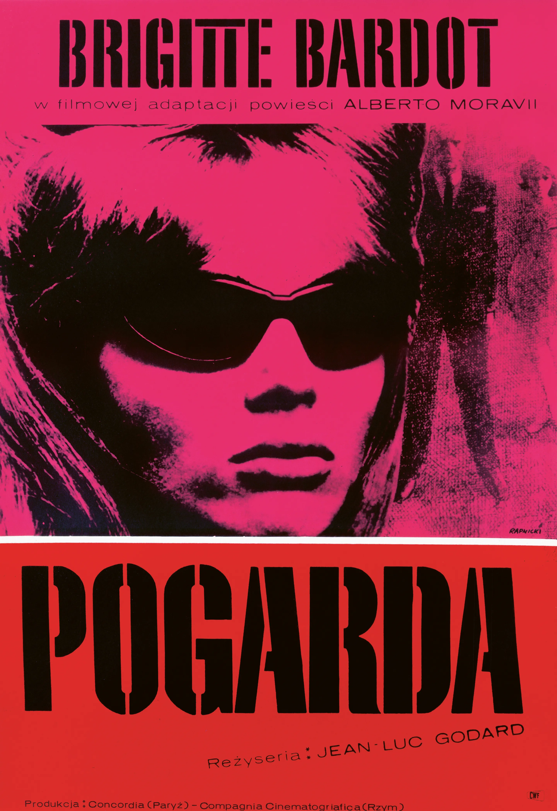

These posters are striking. But how were they made? Lets take a look throughout the ages.

Italians historically have a predisposition for the grand and passionate, and photographic and typographic advancements allowed this to be expressed through the posters made.

Initially made with stone lithographs, post-war Italy made do with the dyes, typically in primary colours. Lithographs were invented by German printer Aloys Senefelder but the technique of producing bug poster colours was perfected by Jules Cherét in France. By the time these techniques made their way to Italy, offset printing was already on the rise.

Having replaced lithographic printing, offset printing brought in a new style of Italian film poster. Often less saturated, but better suited to mimicking the brush strokes painted by the original artists.

\
Professional artists were commissioned to make these colour posters because they were such an integral part of marketing/ The change in social attitudes in the 1960s was echoed in film poster design. Painted posters fell out of favour and photomontages became increasingly popular. The grittiness of New Wave Italian cinema was a clear influence, with high contrast photos being the primary focus.

The rise of photographic and typographic design challenged the illustration styles of early Italian cinema, though people still take influence from the earliest posters. Most recently, the Italian film poster artist Renato Casaro was brought out of retirement to design the posters for Quentin Tarantino’s latest film, Once Upon A Time In Hollywood.

